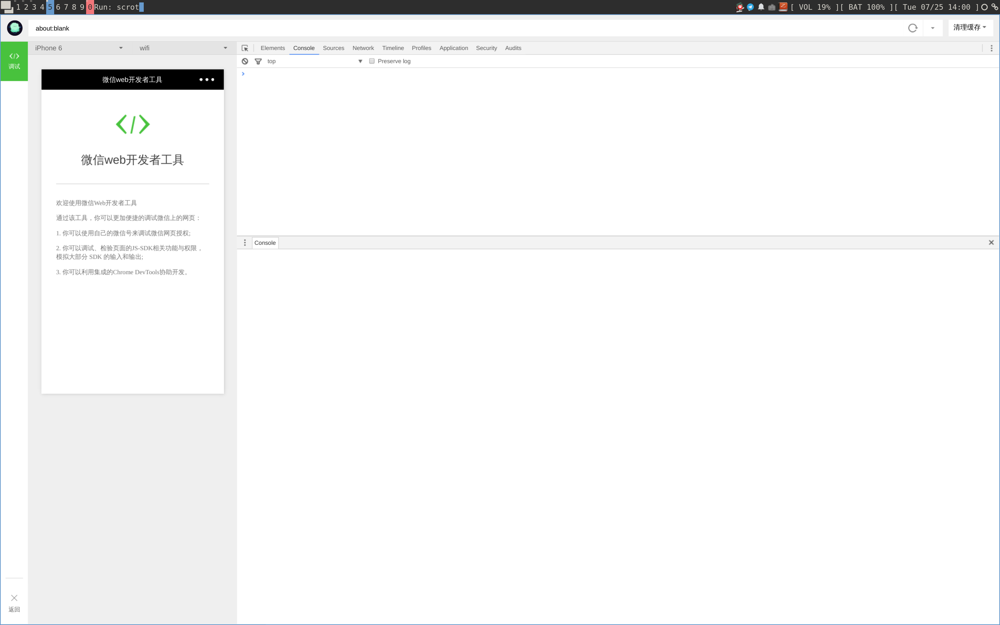

# WeChat Web DevTools
WeChat Web DevTools 是腾讯官方提供用于微信 Web 开发和微信小程序开发的工具。官方对 Windows 和 macOS 提供长期支持，但并没有对 Linux 的支持计划。

该项目尝试提供非官方的 Linux 支持。

## 依赖
+ wine

请用户根据所使用的 Linux Distro 自行安装。

## 下载
### 最新版本
```
git clone https://github.com/m31271n/wechat_web_devtools.git
```

### 特定版本
跳转至 [Release Page](https://github.com/m31271n/wechat_web_devtools/releases) ，下载特定版本。

## 运行
下载完成后，进入目录，运行：

```
./wechat_web_devtools
```

## Linux 包管理器打包计划
+ Gentoo
+ Archlinux
+ Ubuntu

## 截图
### 公众号开发


### 小程序开发
> Demo 来自 [aisin / WechatApp-TodoList](https://github.com/aisin/WechatApp-TodoList)


## 感谢
多数代码来自：

+ [yuan1994 / wechat_web_devtools](https://github.com/yuan1994/wechat_web_devtools)
+ [BruceZhang1993 / wechat_web_devtools](https://github.com/BruceZhang1993/wechat_web_devtools) （Fork 于 yuan1994 / wechat_web_devtools）
+ [cytle / wechat_web_devtools](https://github.com/cytle/wechat_web_devtools)

> 希望这些项目能合并。但又懒得去交涉。

## 免责声明
WeChat Web DevTools 版权归腾讯公司所有。如果侵权，请通知。
